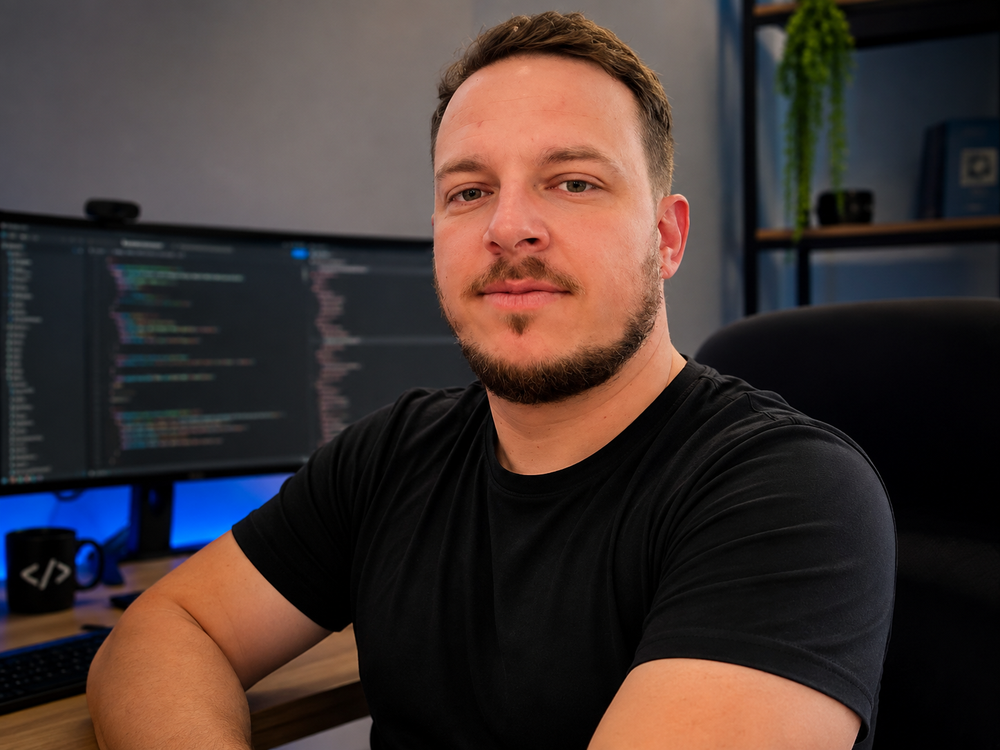

# 👋 Olá! Eu sou Fernando Freitas

## 💻 Sobre mim

Sou Desenvolvedor Backend em formação, estudando Python, FastAPI, PostgreSQL e Docker.

Atualmente estou desenvolvendo o **FA Manager**, um sistema de gestão para empresas de higienização, com foco em orçamentos, clientes, agendamentos e financeiro.

## 🚀 Tecnologias

- 🐍 Python
- ⚡ FastAPI
- 🐘 PostgreSQL
- 🐳 Docker
- 🌐 Git
- 📂 GitHub
- 💻 VS Code

## 📚 Atualmente estudando

- Arquitetura de APIs REST
- SQLAlchemy
- Pydantic
- Git e GitHub
- Backend com Python

## 🚀 Projeto em destaque

### FA Manager

Sistema desenvolvido para gerenciamento de empresas de higienização profissional.

Principais módulos:

- Clientes
- Orçamentos
- Agendamentos
- Serviços
- Financeiro
- Dashboard
- Inteligência Artificial para Orçamentos

## 📫 Contato

📷 Instagram

https://www.instagram.com/amarall.dev/

💻 GitHub

https://github.com/fernandoamaral-f

